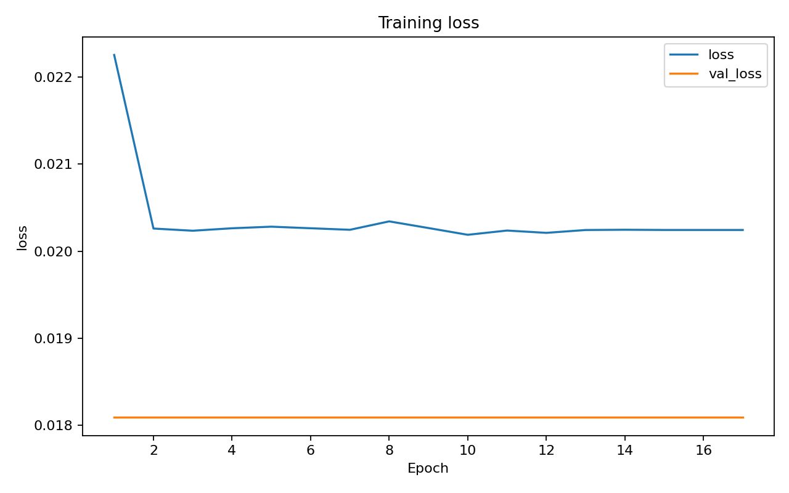
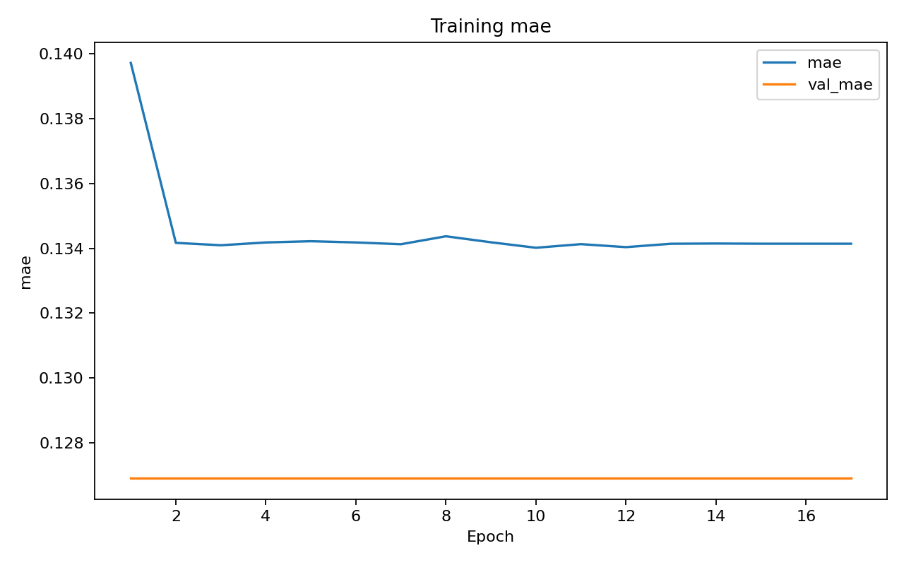

# real-world-advertisement-blocker

https://github.com/ibrahimcaj/real-world-advertisement-blocker/blob/main/docs/videos/rendered-bounding-box.mp4

_Bounding box overlay, detected advertisements highlighted with labelled boxes_

https://github.com/ibrahimcaj/real-world-advertisement-blocker/blob/main/docs/videos/rendered-blur.mp4

_Blur mode, detected advertisement regions replaced with Gaussian blur_

This project develops an AI-based system for detecting real-world advertisements in images and video streams and automatically filtering them by blurring the detected advertisement regions.

The current implementation uses YOLOv8 object detection to locate advertisements and applies a blur effect to the predicted bounding boxes. The long-term goal is to create a system that can reduce unwanted visual advertising in recorded media, live video, and future AR or smart-glasses environments.

---

## Problem Definition & Motivation

Advertisements are present in many public and digital visual environments: billboards, posters, banners, shop signs, digital panels, street advertisements, and branded surfaces. When people take photos, record videos, or use AR devices, these advertisements often become part of the captured scene without the user having control over them.

This creates several problems:

- **Lack of consumer control:** users cannot easily choose whether advertisements appear in their photos, videos, or visual field.
- **Cognitive overload:** dense public environments already contain a large amount of visual information, and advertisements add even more unnecessary content.
- **Visual pollution:** advertisements can dominate streets, buildings, and public spaces.
- **Branding issues:** unwanted logos and promotional content may appear in user-generated content.
- **AR and smart-glasses clutter:** future AR devices may make visual clutter even more noticeable if advertisements are not filtered.
- **Privacy and content moderation concerns:** recorded or streamed content may contain unwanted commercial or sensitive visual material.

The problem addressed by this project is therefore:

> How can we automatically detect real-world advertisements in images and video streams and visually filter them in real time?

---

## Proposed Solution

The proposed solution is a computer vision pipeline that detects advertisement regions and applies automatic visual filtering.

The basic workflow is:

```text
Input image or video frame
        ↓
YOLOv8 advertisement detection
        ↓
Bounding box prediction
        ↓
Blur detected advertisement regions
        ↓
Filtered output image or video
```

Instead of manually editing images or videos, the system automatically finds advertisement regions and blurs them. This makes the approach useful for both static images and video-based applications.

---

## Core Functionality

The current version of the project focuses on:

- detecting advertisements in real-world images
- detecting advertisements in video frames
- returning bounding boxes around detected ads
- blurring the detected advertisement regions
- testing the model on real, local, downloaded, and synthetic data

The current main task is **object detection**. A segmentation-based version was also explored, but it is not yet reliable enough to be used as the final solution.

---

## Applications

Possible applications of this project include:

- **Content moderation:** removing or hiding unwanted advertisements from images or videos.
- **Privacy protection:** reducing the visibility of branded or promotional content in recorded media.
- **AR / smart glasses:** filtering visual clutter from real-world environments.
- **Automatic visual filtering:** blurring advertisement regions without manual editing.
- **Selective ad filtering:** detecting only specific types of advertisements, such as betting, alcohol, banners, billboards, panels, or digital screens.
- **Sponsorship-aware filtering:** using the same idea in reverse, for example blurring everything except selected sponsor advertisements.

---

## Current Status

The project currently includes:

- a YOLOv8-based object detection pipeline
- a combined dataset from multiple sources
- locally collected advertisement images from Bosnia & Herzegovina
- synthetic data generated using Blender and Unreal Engine 5.6
- image and video inference experiments
- automatic blurring of detected advertisement bounding boxes
- an experimental segmentation approach that requires further improvement

Final quantitative results will be added after model training and evaluation are completed.

---

## Dataset & Data Preparation

To train and evaluate the advertisement detection model, we combined multiple data sources. This was done to make the dataset more diverse and to improve the model's ability to recognize advertisements in different environments, formats, lighting conditions, and camera perspectives.

The final dataset consists of approximately **2500 images**.

| Dataset source              | Approximate size | Description                                                                             |
| --------------------------- | ---------------: | --------------------------------------------------------------------------------------- |
| Outdoor Advertising Dataset |     2200+ images | A foundational labeled advertisement dataset downloaded from Roboflow                   |
| Locally collected dataset   |       111 images | Additional real-world advertisement images captured across Bosnia & Herzegovina         |
| Synthetic dataset           |       200 images | Procedurally generated advertisement scenes created using Blender and Unreal Engine 5.6 |
| Total                       |     ~2500 images | Combined dataset used for training and evaluation                                       |

### Outdoor Advertising Dataset

The primary dataset used in this project was an outdoor advertising dataset from Roboflow. This dataset provided more than 2200 labeled images and served as the foundation for training the initial advertisement detection model.

This dataset was useful because it already contained real-world outdoor advertisement examples, including billboards, posters, panels, and other advertisement formats. However, because the visual appearance of advertisements can vary significantly between countries, cities, and environments, we decided to expand the dataset with additional local and synthetic examples.

### Locally Collected Dataset

To make the model more relevant to our environment, we collected an additional dataset of **#111 real-world images#** from Bosnia & Herzegovina. These images were taken in local streets, roads, and urban environments where advertisements appear in forms such as billboards, shop signs, posters, banners, and panels.

This part of the dataset was important because advertisements in Bosnia & Herzegovina may differ from the downloaded dataset in terms of language, design style, placement, street layout, lighting, and background objects.

The locally collected images were manually labeled using **Label Studio**. We used Label Studio to draw bounding boxes around visible advertisement regions for the object detection task. After labeling, the annotations were exported and prepared in the YOLO format so they could be used for training the YOLOv8 detection model.

### Synthetic Dataset

In addition to real-world data, we created a synthetic dataset of approximately 200 images using Unreal Engine 5.6. The goal of this dataset was to increase visual diversity and simulate real-world advertisement scenarios that may not appear often enough in the collected data.

The synthetic data generation process allowed us to control and vary different scene parameters, such as:

- advertisement size
- advertisement position
- camera field of view
- camera distance and angle
- lighting conditions
- environmental layout
- weather conditions
- occlusion level
- day and night scenarios

This made it possible to create additional training examples in controlled but varied environments. Synthetic data was especially useful for testing the model on cases where advertisements appear under different conditions, such as unusual angles, partial occlusion, different scales, or different lighting.

This part of the project is documented separately in more detail:

```text
unreal_data_generator/README.md
```

That README explains the Unreal Engine setup, procedural generation process, configurable parameters, and how the generated images and annotations are produced.

### Data Cleaning

Before training, the dataset was reviewed and cleaned. The preparation process included:

- removing duplicate images
- removing irrelevant or unusable images
- checking whether advertisements were clearly visible
- checking annotation quality
- preparing the data in the correct YOLO format
- organizing the dataset into training, validation, and testing subsets

This step was necessary to reduce noise in the dataset and improve the quality of the model training process.

### Data Labeling

The labeling process focused on marking advertisement regions using bounding boxes. Each visible advertisement was labeled as an object that the YOLOv8 model should detect.

The locally collected dataset was manually labeled because these images did not already contain annotations. The downloaded dataset was also reviewed and adjusted where needed.

We also explored additional labeling for segmentation, where the goal was to mark the exact advertisement area instead of only a rectangular bounding box. However, the segmentation approach did not yet produce reliable enough results, so the current working version of the project focuses on object detection with bounding boxes.

### Dataset Purpose

Using three different data sources helped us cover a wider range of advertisement appearances:

- the downloaded dataset provided a large base of labeled outdoor advertisements
- the locally collected dataset added examples from Bosnia & Herzegovina
- the synthetic dataset added controlled variation through procedural generation

This combination was chosen to improve the model's ability to generalize to real-world images and videos.

---

## Pipeline Architecture & Methodology

### Overview

The system detects and removes real-world advertisements from any visual input - a static image, a recorded video, or a live webcam feed. Detection is a two-stage process: a YOLO model first localises each advertisement with a bounding box, then a ResNet50-based keypoint model refines that region to a precise four-corner polygon. That polygon is blurred and composited back over the original frame, and the result is either displayed as a live overlay or assembled into a downloadable video file.

---

The system accepts input from three sources: a single image, a video file, or a webcam feed. Regardless of the source, each frame is converted into a JPEG image and sent to the backend for processing.

First, a YOLO object detection model (`bounding_best.pt`) analyzes the image and identifies objects of interest. For each detected object, it returns a bounding box, a class label, and a confidence score.

Next, each detected object is cropped from the image and resized to 224×224 pixels. These crops are passed to a ResNet50-based keypoint regression model (`best_point.keras`), which predicts the positions of the four corners of the target object. The model outputs the coordinates of the top-left, top-right, bottom-right, and bottom-left corners.

The predicted corner points are then mapped back from the cropped image to their original positions in the full frame. Using these four points, the system creates a polygon mask that precisely outlines the detected object.

A Gaussian blur is applied only within this polygonal region, leaving the rest of the image unchanged.

Finally, the blurred region is blended back onto the original frame using the polygon mask, producing the final processed image.

The output depends on the input source:

- For webcam streams, the processed frames are displayed in real time on a canvas at the model's inference speed.
- For video files, each processed frame is recorded and combined into a WebM video, which is made available for download once processing is complete.
- For static images, the final processed image is returned immediately.

---

### Stage 1 - YOLO Detection

**Model:** `bounding_best.pt` (YOLOv11, fine-tuned)

The YOLO model runs on the full input frame and returns axis-aligned bounding boxes for every detected advertisement. Each detection carries a normalised `[x1, y1, x2, y2]` box, a `class_id`, and a `confidence` score. Boxes below a confidence threshold are discarded by Ultralytics' built-in NMS before results are returned.

**Training data** was assembled from three sources:

- Real-world images annotated via Roboflow
- Additional collected images labelled with bounding boxes
- Synthetic frames rendered in Unreal Engine using the bundled `unreal_data_generator`, which outputs YOLO-format label files alongside each rendered frame

The model is served via FastAPI (`backend/server.py`) and receives frames as multipart JPEG uploads over a local HTTP connection.

---

### Stage 2 - Keypoint Regression

**Model:** `best_point.keras` (ResNet50 backbone, frozen → fine-tuned)

A bounding box is a rectangle and may include background that surrounds a tilted or perspective-distorted billboard. The keypoint model tightens this to a quadrilateral by predicting the four physical corners of the advertisement surface.

**Architecture:**

```
ResNet50 (ImageNet weights, 224×224 input)
    └── GlobalAveragePooling (built into ResNet top removal)
    └── Flatten
    └── Dense(256) + ReLU
    └── Dense(8)          ← [tl_x, tl_y, tr_x, tr_y, br_x, br_y, bl_x, bl_y]
```

The output is 8 continuous values, each normalised to `[0, 1]` within the crop. Huber loss is used during training because it is less sensitive to the occasional outlier keypoint annotation than MSE.

**Training procedure:**

1. **Phase 1 - feature extraction:** ResNet50 weights frozen; only the Dense head trained for initial convergence.
2. **Phase 2 - fine-tuning:** ResNet50 unfrozen; entire network trained end-to-end at a lower learning rate (`1e-5`).

Callbacks: `ModelCheckpoint` (saves best validation loss), `EarlyStopping` (patience 8), `ReduceLROnPlateau` (patience 4, factor 0.5).

**Training data** is a set of YOLO-cropped advertisement images labelled with four corner keypoints (`tl`, `tr`, `br`, `bl`) exported from Label Studio as a JSON annotation file.

---

### Stage 3 - Polygon Mask and Blur

Once the four corners are known in crop-local coordinates they are mapped back to full-frame pixel coordinates by:

```
frame_x = box_x1 + keypoint_x * (box_x2 - box_x1)
frame_y = box_y1 + keypoint_y * (box_y2 - box_y1)
```

A filled convex polygon is drawn from these four points to produce a binary mask. A Gaussian blur kernel - sized relative to the detection area so small and large ads blur proportionally - is applied to the full frame, and then the blurred result is composited onto the original using the polygon mask as the blending weight.

---

### Stage 4 - Compositing and Output

The composited frame replaces the source in the rendering pipeline:

- **Live / streaming mode:** The processed frame is drawn onto an HTML5 `<canvas>` element that sits exactly over the `<video>` element. The canvas is updated at the configured inference FPS via `requestAnimationFrame`.
- **Render-to-file mode:** Each processed frame is committed to a `MediaRecorder` stream via `canvas.captureStream(0)` + `track.requestFrame()`. When all frames are processed the recorder is stopped and the accumulated chunks are offered to the user as a `.webm` download.

The backend is stateless per request: it receives a raw frame, runs both models, and returns JSON. All rendering, masking, and blurring logic runs in the browser.

---

## Object Detection Results

The object detection model was trained on the merged dataset containing the downloaded outdoor advertising dataset, locally collected images, and synthetic data. The current model uses YOLOv8 for detecting advertisement regions and returns bounding boxes that are later used for blurring.

The current object detection results are:

| Metric    | Value |
| --------- | ----: |
| Precision | 0.570 |
| Recall    | 0.576 |
| F1 score  | 0.573 |
| mAP50     | 0.594 |
| mAP50-95  | 0.435 |

These results show that the model is able to detect advertisement regions, while still leaving room for improvement. The precision and recall values are relatively balanced, which means the model does not strongly favor either over-detecting or missing advertisements. The mAP50 score is higher than the stricter mAP50-95 score, which is expected because mAP50-95 evaluates localization quality across multiple IoU thresholds.

During training, the model showed improvement across epochs. The mAP50 increased from approximately 0.447 in the first epoch to approximately 0.595 in the final epoch, while mAP50-95 increased from approximately 0.319 to approximately 0.436. Training and validation losses also generally decreased, indicating that the model was learning from the merged dataset.


---

## Segmentation Results

We also experimented with a segmentation-based model because segmentation could theoretically provide cleaner filtering by detecting the exact advertisement area instead of only using a rectangular bounding box. However, the segmentation results were not satisfactory enough for the final version of the project.

The model did not produce reliable masks across the tested examples, especially for small advertisements, complex backgrounds, and partially visible advertisement regions. Because of this, we decided not to use the segmentation model in the final pipeline. The final working solution therefore focuses on YOLOv8 object detection and bounding-box blurring.

The training curves for the segmentation experiment are shown below:





---

## Repository Structure & Setup

### Structure

- `app/` - the Next.js web app. `app/` is the page, `components/` holds the video detector UI, `backend/` holds the Python FastAPI server and its startup script
- `models/` - trained model weights (`bounding_best.pt`). Not committed if large; place files here manually
- `notebooks/` - two Colab training notebooks: `yolo_detection.ipynb` trains the YOLO bounding box model, `keypoint_model.ipynb` trains the ResNet50 corner keypoint model
- `datasets/` - raw training data split into `additional/` (real-world photos with labels) and `synthetic/` (Unreal Engine renders with auto-generated labels)
- `unreal_data_generator/` - the Unreal Engine project used to generate synthetic training data; `source_code/` is the C++ plugin, `unreal_project/` has blueprints and render targets, `scripts/` has a label validation utility
- `docs/` - training graphs (loss curves, detection metrics)
- `videos/` - sample output videos showing bounding box and blur render modes
- `PIPELINE.md` - full architecture and methodology writeup

### Setup

Prerequisites

- Node.js 18+ and pnpm (npm i -g pnpm)
- Python 3.10+

---

1. Clone the repo

git clone https://github.com/ibrahimcaj/real-world-advertisement-blocker.git
cd real-world-advertisement-blocker

---

2. Install Next.js packages

cd app
pnpm install

---

3. Install Python dependencies

python3 -m pip install -r app/backend/requirements.txt

This installs: fastapi, uvicorn, ultralytics, pillow, python-multipart.

> Apple Silicon users: if you get an incompatible architecture error for `pydantic-core`, run:
> `pip3 install --force-reinstall pydantic-core`

---

4. Place the model

The YOLO model file should be placed at:
models/bounding_best.pt (repo root, not inside frame_detection_app)

The backend resolves this path automatically relative to server.py.

---

5. Run

Open two terminals:

Terminal 1, Python backend:
python3 app/backend/start.py
This installs deps if requirements.txt changed, then starts the FastAPI server on
http://localhost:8000.

Terminal 2, Next.js frontend:
cd app
pnpm dev
Opens on http://localhost:3000.

---

6. Verify

- Open http://localhost:3000
- The sidebar should show "Model ready" in grey, if it says "Server offline" the Python backend
  isn't running
- Load a video file, hit Render video

---

## Current Limitations

Although the current object detection pipeline provides a functional first version of advertisement filtering, there are still several limitations.

### Bounding Box Precision

The current system uses object detection, which means that advertisements are detected using rectangular bounding boxes. This works well for locating advertisements, but it is not always visually precise. If an advertisement has an irregular shape, the blur may also cover parts of the background around the ad.

A segmentation-based approach would be more precise because it could follow the exact borders of the advertisement. However, the current segmentation experiment does not yet produce reliable enough results for final use.

### Segmentation Performance

We experimented with segmentation because it would allow cleaner and more accurate advertisement filtering. However, the segmentation model currently performs poorly in several cases, especially when advertisements are small, partially occluded, placed at difficult angles, or surrounded by complex backgrounds.

Because of this, segmentation is currently treated as an experimental direction rather than the main working solution.

### Dataset Coverage

The combined dataset includes downloaded, locally collected, and synthetic images, but advertisements appear in many different formats and environments. The current dataset may still not cover all possible real-world cases, such as:

- very small advertisements
- heavily occluded advertisements
- digital screens
- unusual billboard shapes
- advertisements at night
- advertisements in bad weather
- reflections or motion blur
- text-heavy signs that are not advertisements

This means that the model may still fail or produce false detections in some real-world situations.

### False Positives

The model may sometimes confuse advertisements with visually similar objects, such as shop signs, posters, road signs, banners, logos, or text-heavy surfaces. This is a difficult problem because the boundary between an advertisement and a regular sign is not always visually obvious.

### Real-Time Performance

The project is designed with real-time or near-real-time filtering in mind, but the actual performance depends on the model size, input resolution, hardware, and video quality. Higher accuracy models may process frames more slowly, while smaller models may be faster but less accurate.

### Synthetic Data Gap

Synthetic data is useful for increasing variation and testing controlled scenarios, but it cannot fully replace real-world data. Generated environments may still differ from real images in texture quality, lighting realism, object placement, and background complexity.

For this reason, synthetic data is used as an addition to real-world data, not as a full replacement.

---

## Future Work

Several improvements are planned for future versions of the project.

### Improve Segmentation

One of the main future goals is to improve the segmentation model. A successful segmentation approach would allow the system to blur only the exact advertisement area instead of blurring the entire rectangular bounding box.

This would make the output cleaner and more visually accurate, especially for irregularly shaped advertisements, posters, banners, and signs.

### Expand the Dataset

The dataset can be improved by collecting and labeling more real-world advertisement images. Future data collection should focus on difficult cases, such as:

- night scenes
- rainy or snowy conditions
- low-light environments
- small advertisements
- partially hidden advertisements
- digital billboards
- advertisements from different cities and countries
- different camera angles and distances

Adding more diverse examples would help the model generalize better to real-world images and videos.

### Improve Synthetic Data Generation

The synthetic data generation pipeline can also be expanded. Future improvements could include more realistic environments, more advertisement formats, better lighting variation, more weather conditions, and more complex occlusion scenarios.

The synthetic generation system could also be used to create specific difficult examples that are rare in the real dataset.

### Optimize for Real-Time Video

Future work should include optimization for real-time video processing. This could involve:

- testing smaller YOLOv8 model variants
- reducing input resolution
- using GPU acceleration
- improving frame processing speed
- optimizing video reading and writing
- testing the model on live camera input

This would make the project more suitable for real-time applications such as AR devices, smart glasses, or live video filtering.

### Improve Evaluation

After the final training is completed, the model should be evaluated using standard object detection metrics such as precision, recall, mAP50, mAP50-95, and inference speed.

Future evaluation should also include visual comparisons on real images, synthetic images, and video examples. This would make it easier to understand not only the numerical performance of the model, but also its practical usefulness.

### Deployment Possibilities

In the future, the project could be developed into a more complete application or prototype. Possible deployment directions include:

- mobile application
- browser-based demo
- AR/smart-glasses prototype
- content moderation pipeline

These directions would require additional optimization, testing, and user interface development.
